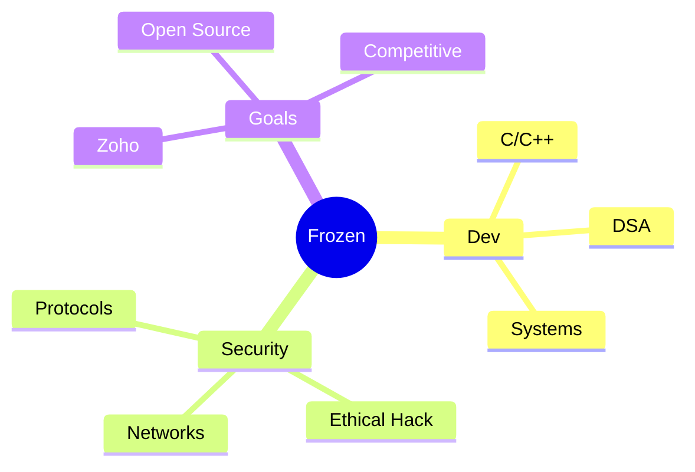

# Hi there! I'm **Frozen** ✨

<div align="center">
  
  [](https://git.io/typing-svg)
  
  **Passionate about software development and cybersecurity**
  
  
  [](https://github.com/Frozen-47)
  
</div>

---

## 🎯 About Me

```yaml
name: Frozen (Sabareesh)
role: Computer Science Student & Aspiring Software Developer
focus: ["Software Development", "Cybersecurity", "Competitive Programming"]
current_goal: "Landing at Zoho & mastering DSA"
languages: ["C/C++", "Java", "JavaScript", "HTML/CSS"]
motto: "Writing efficient, optimized code for real-world solutions"
status: "Open to internships & collaborations 🚀"
```

---

## 💻 Tech Stack

<div align="center">

### Languages


### Tools & Technologies


</div>

---

## 📊 GitHub Stats

<div align="center">
  


</div>

---

## 🏆 GitHub Trophies

<div align="center">
  


</div>

---

## 📈 Contribution Graph

<div align="center">

[](https://github.com/ashutosh00710/github-readme-activity-graph)

</div>

---

## 🔥 Current Focus

<div align="center">



</div>

---

## 🤝 Let's Connect

<div align="center">

[](mailto:sabareeshgm47@gmail.com)
[](https://linkedin.com/in/sabareesh-gm)
[](https://frozen47.vercel.app)

**💼 Open to internships, collaborations, and learning opportunities!**

</div>

---

<div align="center">
  
### *"Every expert was once a beginner"* 💭


</div>
